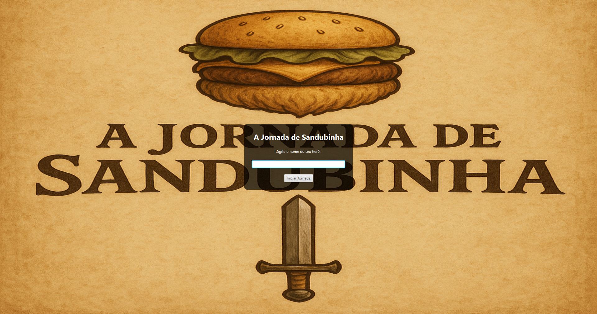
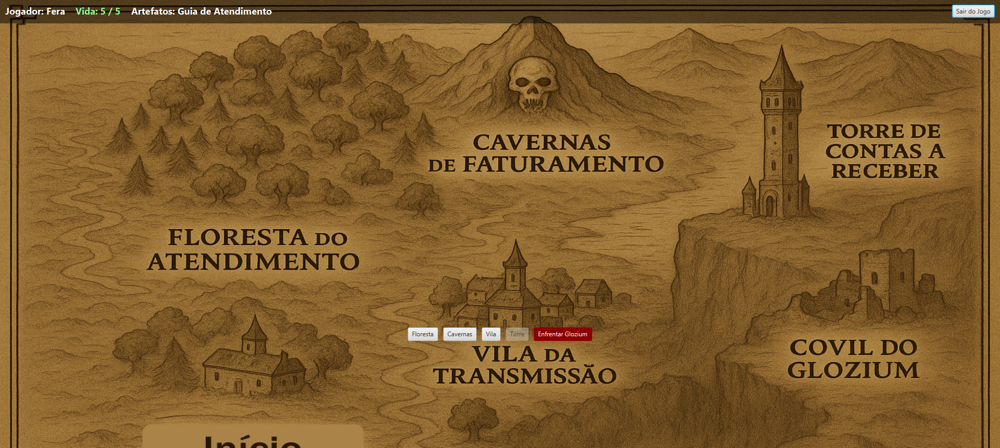
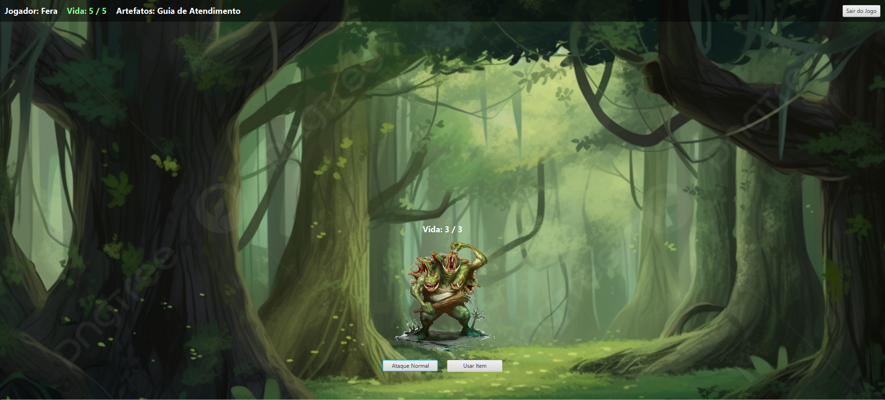

# A Jornada de Sandubinha - RPG com Interface Gráfica

## 📖 Descrição do Projeto
"A Jornada de Sandubinha" é um jogo de RPG interativo, desenvolvido em Java com a tecnologia JavaFX. O projeto foi criado como um desafio técnico, demonstrando a aplicação de conceitos de programação orientada a objetos, design de interface de usuário e gerenciamento de estado de jogo.

No jogo, o jogador assume o papel de Sandubinha, o último descendente de uma linhagem de guerreiros, em uma missão para derrotar o vilão Glozium, que mergulhou o mundo em caos e neblina. A jornada se desenrola através de diferentes regiões, cada uma com seus próprios desafios, monstros e recompensas.

## ✨ Funcionalidades Principais

* **Interface Gráfica Completa:** O jogo, originalmente um desafio de console, foi totalmente migrado para uma aplicação de desktop rica e interativa usando **JavaFX** e **FXML**.
* **Narrativa Visual:** Cenas de diálogo com personagens e imagens de fundo dinâmicas que mudam de acordo com a fase do jogo, aumentando a imersão.
* **Sistema de Batalha por Turnos:** Um sistema de combate estratégico baseado em sorteios de números, com uma mecânica de "Número Secreto" para determinar os acertos.
* **Mecânicas de Itens Especiais:** Um inventário de artefatos onde cada item possui um benefício e uma consequência única em batalha (aumento de sorteios, dano extra, atordoamento de inimigos, auto-dano, etc.).
* **Progressão Lógica:** O jogador deve completar fases em uma sequência lógica para adquirir itens-chave, como a "Capa" para acessar a Torre, e todos os artefatos para o evento final de forjar a espada.
* **Eventos Interativos:** O jogo utiliza diálogos e pop-ups (`Alert`, `ChoiceDialog`) para interações cruciais, como a escolha de itens em combate ou a decisão de forjar a Espada ZG.
* **Design de Som:** Efeitos sonoros para ações (cliques) e trilhas sonoras que mudam dinamicamente com a cena (menu, mapa, batalha, chefe final), gerenciados por uma classe central `SoundManager`.
* **Gerenciamento de Estado:** O progresso do jogador (fases concluídas, inventário) é rastreado, e a interface se atualiza dinamicamente, desabilitando botões de fases já completas.

## 🛠️ Tecnologias Utilizadas
* **Linguagem:** Java (utilizando JDK 17+)
* **Interface Gráfica:** JavaFX 17
* **Build e Gerenciamento de Dependências:** Apache Maven
* **IDE:** Desenvolvido no Visual Studio Code

## 🚀 Como Executar o Projeto

### Pré-requisitos
* **JDK 17 ou superior** instalado.
* **JAVA_HOME** configurado corretamente nas variáveis de ambiente do seu sistema.
* **Apache Maven** instalado e configurado no PATH do sistema.

### Passos
1.  **Clone o repositório:**
    ```bash
    git clone [URL_DO_SEU_REPOSITORIO_AQUI]
    ```
2.  **Navegue até a pasta do projeto:**
    ```bash
    cd rpg-sandubinha-gui
    ```
3.  **Compile e execute o projeto com Maven:**
    O plugin do JavaFX configurado no `pom.xml` facilita a execução. Use o seguinte comando no seu terminal:
    ```bash
    mvn javafx:run
    ```
O Maven irá baixar todas as dependências necessárias e iniciar a aplicação.

## 🖼️ Screenshots

**Tela Inicial:**


**Tela Principal (Mapa):**


**Cena de Batalha:**


## 👨‍💻 Desenvolvedor
* **[Seu Nome Completo]**
* **LinkedIn:** https://www.linkedin.com/in/javanfranca/
* **GitHub:** https://github.com/javanfa